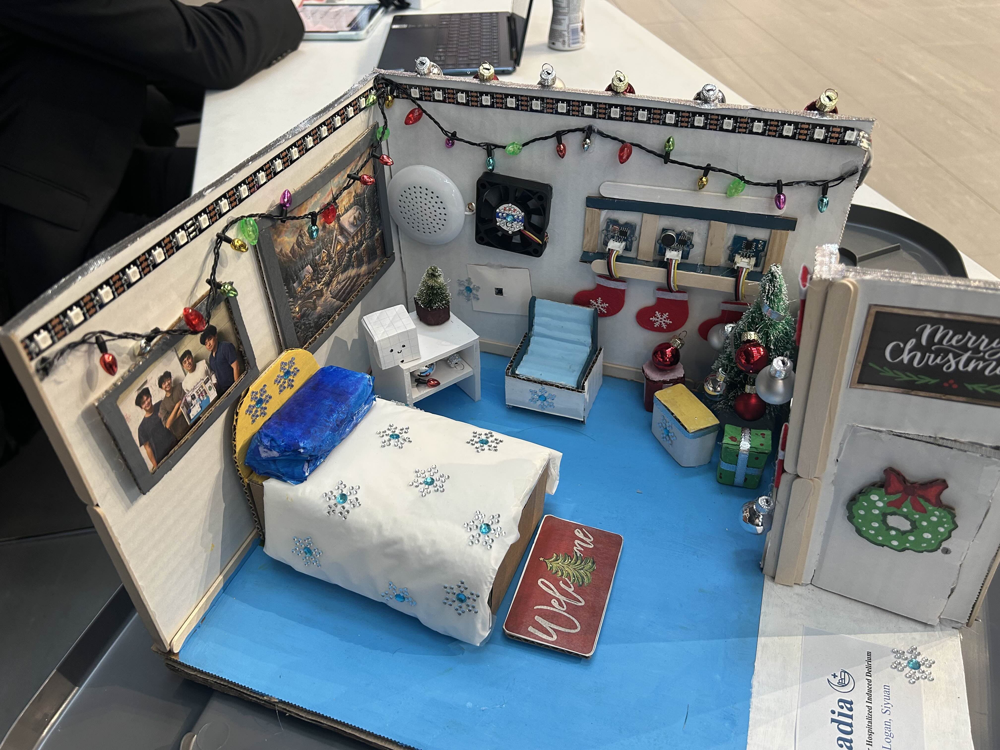
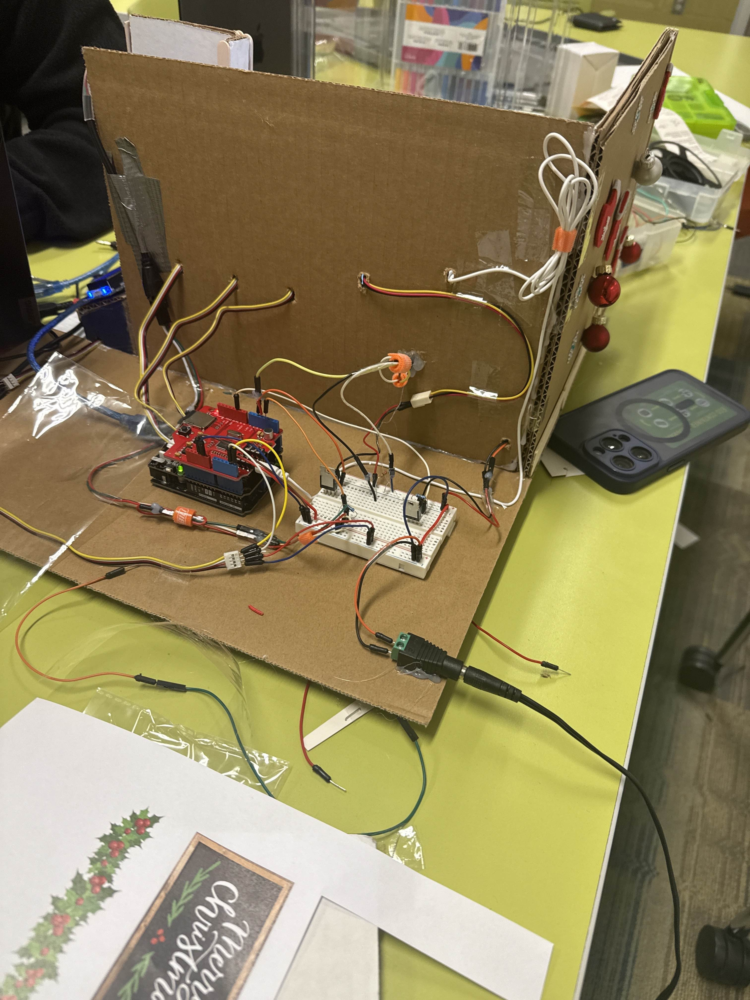

# Circadia

Circadia is an Arduino-based smart environmental control system designed to reduce hospital-induced delirium by stabilizing light, sound, and temperature. The system creates a calmer, more predictable room environment to support sleep and reduce stress, especially for elderly patients.

This repository is a personal copy of a group project created for portfolio and reference purposes.

---

### Project Overview

Hospital rooms are often overstimulating due to harsh lighting, sudden noise, and temperature fluctuations. Circadia continuously monitors environmental conditions and automatically adjusts the room using simple, non-invasive hardware to improve patient comfort and sleep quality.

---

### System Features

- **Circadian Lighting**
  - LED strip adjusts brightness and color based on ambient light
  - Warmer, dimmer tones at night; brighter lighting during the day
  - Smooth transitions to avoid sudden visual disturbances

- **Adaptive Sound Control**
  - Sound sensor detects loud or sudden noise
  - White noise plays to mask disruptive sounds and alarms

- **Temperature Regulation**
  - Temperature sensor monitors room conditions
  - Fan cools when too warm, heating pad warms when too cold
  - MOSFETs allow smooth power control instead of simple on/off switching

- **Customizable Button**
  - Triggers predefined comfort modes
  - Can be reprogrammed to activate preferred light and sound profiles

---

### Signal Processing (Normalization & Filtering)

To improve stability and reliability:
- **Normalization** is applied to sensor readings so different inputs (light, sound, temperature) can be handled consistently.
- **Moving averages** are used to smooth noisy sensor data, preventing rapid fluctuations that could cause sudden environmental changes.

This ensures the system responds gradually and predictably rather than reacting to brief spikes.

---

### Hardware Components

**Sensors**
- Light Sensor (LDR)
- Temperature Sensor (Thermistor)
- Sound Sensor (Microphone module)

**Actuators**
- WS2812B LED Strip
- DC Fan
- Heating Pad
- Speaker (white noise)

**Control & Interface**
- Arduino Uno
- MOSFETs (fan and heater control)
- Push Button
- LCD Display (environment status)

---

### Software Structure

The project uses modular Arduino files, separating:
- Main control loop
- Lighting control
- Temperature control
- Sound detection
- Display logic  

This improves readability, debugging, and scalability.

---

### Testing & Validation

- Sensors tested under varying light, sound, and temperature conditions
- MOSFET-driven fan and heater verified for smooth response
- LED transitions tested to ensure gradual changes
- Full system tested together for stable, predictable behavior

---

### Physical Model

  

<em>
Physical model of the Circadia system showing the integrated enclosure, lighting, and control layout.
</em>

### Wiring Layout

  

<em>
Internal wiring layout illustrating sensor inputs, actuators, and microcontroller connections.
</em>

